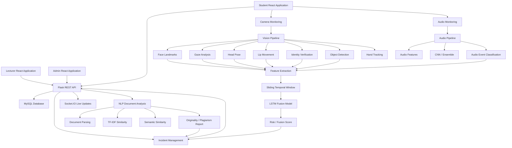

# TrueWatch

## Intelligent Multi-Modal Exam Proctoring System

TrueWatch is a final-year software engineering project that combines web-based examination management with multi-modal AI-assisted examination monitoring. The system brings together computer vision, audio analysis, identity verification, object detection, temporal risk fusion, browser monitoring, and NLP-based plagiarism analysis into a single examination workflow.

The repository contains separate interfaces for **students, lecturers, and administrators**, a Flask-based backend, AI/ML modules, trained model assets, database models, monitoring utilities, notebooks, and automated tests.

> **Project classification:** Final-year B.Sc. (Hons) Software Engineering project  
> **Primary purpose:** AI-assisted examination monitoring and evidence-based review  
> **Architecture:** React frontends + Flask API + MySQL + local AI/ML processing components

---

## Table of Contents

- [Project Overview](#project-overview)
- [Core Objectives](#core-objectives)
- [Key Features](#key-features)
- [System Architecture](#system-architecture)
- [AI and Monitoring Pipeline](#ai-and-monitoring-pipeline)
- [User Roles](#user-roles)
- [Technology Stack](#technology-stack)
- [Repository Structure](#repository-structure)
- [Database Model](#database-model)
- [Installation](#installation)
- [Backend Configuration](#backend-configuration)
- [Running the Application](#running-the-application)
- [Testing](#testing)
- [Model Assets](#model-assets)
- [API Overview](#api-overview)
- [Examination Workflow](#examination-workflow)
- [Risk and Incident Processing](#risk-and-incident-processing)
- [Plagiarism Detection](#plagiarism-detection)
- [Privacy and Security](#privacy-and-security)
- [Current Limitations](#current-limitations)
- [Development Notes](#development-notes)
- [Academic Context](#academic-context)
- [License](#license)

---

## Project Overview

Online examinations create challenges around academic integrity, identity verification, behavioural monitoring, environmental monitoring, and post-examination document integrity.

TrueWatch addresses these areas through a multi-modal architecture. The project combines:

- Real-time facial and behavioural analysis
- Eye-gaze and head-pose monitoring
- Lip movement monitoring
- Pre-exam calibration
- Audio anomaly classification
- Identity verification
- Prohibited-object detection
- Browser/tab monitoring
- Temporal multi-signal fusion
- Plagiarism and semantic similarity analysis
- Timestamped incident logging
- Live lecturer monitoring
- Examination/session management
- Lecturer review and grading
- Administrative user and batch management

The project proposal defines three principal AI components: visual behavioural analysis, audio anomaly classification, and document integrity analysis. The implementation in this repository additionally contains identity verification, object detection, hand tracking, browser monitoring, and an LSTM-based fusion component.

---

## Core Objectives

TrueWatch is designed to:

1. Provide an integrated examination platform for students and lecturers.
2. Monitor multiple examination signals rather than relying on a single visual indicator.
3. Establish candidate-specific visual baselines through calibration.
4. Detect potentially anomalous behaviour and environmental events.
5. Combine signals over time using a temporal fusion model.
6. Preserve timestamped evidence for lecturer review.
7. Analyse submitted documents for plagiarism and semantic similarity.
8. Provide role-specific interfaces for students, lecturers, and administrators.
9. Support local development and locally hosted AI inference components.
10. Provide a structured software engineering platform suitable for academic evaluation.

---

# Key Features

## Student Application

The student frontend includes:

- Student authentication
- Student dashboard
- Profile management
- Examination room
- Pre-exam calibration
- Face registration
- Results
- Settings
- Camera monitoring
- Audio monitoring

The student application is implemented with React, Vite, Tailwind CSS, Axios, React Router, Recharts, and Socket.IO client.

### Examination Preparation

The monitoring pipeline includes:

1. Identity registration
2. Eye-condition check
3. Audio calibration
4. Visual calibration
5. Start of monitoring
6. Examination
7. Submission
8. Post-examination processing

---

## Lecturer Application

The lecturer frontend provides:

- Lecturer authentication
- Dashboard
- Examination creation
- Examination list
- Batch management
- Student management
- Session management
- Live monitoring
- Session details
- Results
- Plagiarism corpus management
- Plagiarism review
- Evidence and incident review

The lecturer can review monitoring information rather than relying on a single automated decision.

---

## Administration Application

The administrator frontend provides:

- Administrator authentication
- Dashboard
- User management
- Batch management
- Session management
- Session detail review

The backend also exposes administrative APIs for creating, updating, and deleting users and batches.

---

# System Architecture



---

# AI and Monitoring Pipeline

## 1. Visual Behavioural Analysis

The visual monitoring components are located primarily under:

```text
modules/vision/
```

The implementation contains modules for:

- Face tracking
- Facial landmark processing
- Gaze analysis
- Head-pose estimation
- Lip movement detection
- Face cropping
- Identity verification
- Object detection
- Hand tracking
- Frame enhancement
- Calibration

### Face and Behaviour Monitoring

The face tracker works with MediaPipe facial landmarks and supports:

- Face presence detection
- Multiple-face detection
- Gaze feature extraction
- Head-pose estimation
- Lip movement measurements
- Frame enhancement
- Calibration
- Eye-condition checks

The project proposal specifies CLAHE-based low-light enhancement and candidate-specific calibration as part of the visual pipeline.

---

## 2. Identity Verification

TrueWatch includes an identity verification component:

```text
modules/vision/identity_verifier.py
```

The system supports:

- Identity registration
- Identity verification
- Confidence recording
- Identity-check events associated with examination sessions

The backend stores identity-check information through the `IdentityCheck` model.

---

## 3. Object Detection

Object detection is implemented through:

```text
modules/vision/object_detector.py
```

The repository includes:

```text
yolov8n.pt
```

as an Ultralytics YOLO model asset.

Object detection events are stored through the backend's `ObjectDetectionEvent` model and can be associated with examination sessions.

---

## 4. Hand Tracking

The repository includes:

```text
modules/vision/hand_tracker.py
models/hand_landmarker.task
```

This provides a separate hand-tracking component that can be used as an additional visual signal during monitoring.

---

## 5. Audio Analysis

Audio processing is implemented under:

```text
modules/audio/
```

The repository includes:

- `audio_stream.py`
- `audio_inference.py`
- `cnn_model.py`
- `esc50_loader.py`
- `sound_classifier.py`

The audio pipeline supports:

- Audio stream processing
- Audio energy/features
- Mel-spectrogram generation
- CNN inference
- Ensemble inference
- Rule-based audio classification
- Audio event monitoring

The project uses an ESC-50-based workflow together with custom examination-environment audio.

---

## 6. Temporal Fusion

TrueWatch includes a temporal fusion subsystem under:

```text
modules/fusion/
```

Important components include:

- `feature_extractor.py`
- `lstm_model.py`
- `mendeley_loader.py`
- `training_plots.py`

The runtime monitoring loop creates a sliding temporal window and passes multi-signal features to an LSTM fusion model.

The repository includes:

```text
models/fusion_lstm.keras
models/ensemble_weight.txt
```

The fusion subsystem is intended to combine behavioural and environmental signals over time instead of treating every individual event as an isolated decision.

---

# User Roles

TrueWatch defines three primary application roles.

## Student

Students can:

- Authenticate
- View their dashboard
- Complete calibration
- Register identity
- Enter examinations
- Be monitored during examinations
- Submit answers
- View examination results

## Lecturer

Lecturers can:

- Create examinations
- Manage examinations
- Manage batches
- View students
- Monitor active sessions
- Review incidents
- Review session details
- Review plagiarism information
- View results
- Enter academic grades

## Administrator

Administrators can:

- Manage users
- Manage batches
- View sessions
- Review session information
- Access administrative dashboards

---

# Technology Stack

## Backend

| Technology | Purpose |
|---|---|
| Python | Backend and AI/ML development |
| Flask | REST API |
| Flask-SQLAlchemy | Database ORM |
| Flask-SocketIO | Real-time communication |
| MySQL | Application database |
| PyMySQL | MySQL database driver |
| OpenCV | Computer vision processing |
| MediaPipe | Facial/hand landmark processing |
| DeepFace | Identity verification |
| Ultralytics YOLO | Object detection |
| TensorFlow / Keras | Neural network inference/training |
| LightGBM | Audio ensemble component |
| Librosa | Audio processing |
| SoundDevice | Audio stream capture |
| scikit-learn | Machine-learning utilities |
| sentence-transformers | Semantic document similarity |
| PyMuPDF | PDF parsing |
| python-docx | DOCX parsing |
| pytest | Automated testing |

## Frontend

Each interface is a separate React/Vite application.

### Student

- React
- Vite
- React Router
- Axios
- Tailwind CSS
- Recharts
- Socket.IO Client
- MediaPipe Tasks Vision

### Lecturer

- React
- Vite
- React Router
- Axios
- Tailwind CSS
- Recharts
- Socket.IO Client

### Admin

- React
- Vite
- React Router
- Axios
- Tailwind CSS
- Recharts

---

# Repository Structure

```text
TrueWatch-Bug-Fixing/
│
├── backend/
│   ├── api.py
│   ├── app.py
│   ├── database.py
│   ├── models.py
│   ├── seed_test_data.py
│   ├── requirements.txt
│   │
│   ├── routes/
│   └── utils/
│       ├── api_client.py
│       ├── incident_logger.py
│       └── tab_monitor.py
│
├── frontend/
│   ├── student/
│   │   └── src/
│   │       ├── components/
│   │       ├── context/
│   │       ├── hooks/
│   │       └── pages/
│   │
│   ├── lecturer/
│   │   └── src/
│   │       ├── components/
│   │       ├── context/
│   │       └── pages/
│   │
│   └── admin/
│       └── src/
│           ├── components/
│           ├── context/
│           └── pages/
│
├── models/
│   ├── audio_cnn.keras
│   ├── audio_lgbm.pkl
│   ├── audio_label_encoder.pkl
│   ├── audio_scaler.pkl
│   ├── face_landmarker.task
│   ├── fusion_lstm.keras
│   ├── hand_landmarker.task
│   ├── plagiarism_model.pkl
│   ├── plagiarism_feature_cols.pkl
│   └── plagiarism_model_info.txt
│
├── modules/
│   ├── audio/
│   ├── fusion/
│   ├── nlp/
│   └── vision/
│
├── notebooks/
│   ├── 01_vision_model_training.ipynb
│   ├── 02_audio_model_training.ipynb
│   ├── 03_nlp_model_training.ipynb
│   ├── 04_fusion_model_training.py
│   ├── 05_audio_model_training.py
│   └── TrueWatch_Audio_Colab_2.ipynb
│
├── tests/
│   ├── test_audio.py
│   ├── test_identity.py
│   ├── test_nlp.py
│   ├── test_object_detection.py
│   └── test_vision.py
│
├── tab_monitor.py
├── requirements.txt
├── .gitignore
├── .gitattributes
└── README.md
```

---

# Database Model

The backend uses Flask-SQLAlchemy with MySQL.

The main database entities currently defined in `backend/models.py` include:

```text
User
Batch
Exam
ExamEnrollment
Session
Incident
PlagiarismReport
CalibrationProfile
StudentGrade
ExamQuestion
StudentAnswer
IdentityCheck
ObjectDetectionEvent
FusionScore
```

The model layer also defines enumerations for:

- User roles
- Examination types
- Assignment types
- Examination status
- Session results
- Risk levels

### Session Information

A session can contain:

- Session token
- Start/end timestamps
- Risk score
- Session result
- AI summary
- Auto-graded score where applicable
- Student answers
- Incidents
- Identity checks
- Object detections
- Fusion scores
- Plagiarism information

---

# Installation

## Prerequisites

The repository requires:

- Python environment compatible with the pinned backend dependencies
- Node.js and npm
- MySQL
- Webcam for visual monitoring
- Microphone for audio monitoring

The AI components may require additional platform-specific configuration depending on the operating system and hardware.

---

## 1. Clone the Repository

```bash
git clone <your-repository-url>
cd TrueWatch-Bug-Fixing
```

---

## 2. Create a Python Environment

Example:

```bash
python3 -m venv .venv
source .venv/bin/activate
```

On Windows:

```powershell
python -m venv .venv
.venv\Scripts\activate
```

---

## 3. Install Backend Dependencies

The repository contains a dedicated backend requirements file:

```bash
pip install -r backend/requirements.txt
```

The root `requirements.txt` contains an additional broader development environment.

For normal backend execution, use the dependency set appropriate for the backend environment.

---

# Backend Configuration

The current database initialization expects a local MySQL database named:

```text
truewatch
```

The current implementation uses:

```text
mysql+pymysql://root:@localhost/truewatch
```

Therefore, create the database before starting the API:

```sql
CREATE DATABASE truewatch;
```

The application creates the database tables through SQLAlchemy when the backend starts.

> **Important:** The database connection is currently defined directly in `backend/database.py`. For a production deployment, move database credentials into environment variables.

---

# Running the Backend

From the project root:

```bash
python -m backend.api
```

The API starts on:

```text
http://localhost:5001
```

Health check:

```text
GET /api/health
```

Expected service response:

```json
{
  "status": "ok",
  "service": "TrueWatch API v2.1"
}
```

---

# Running the Frontends

Each role has its own Vite application.

## Student

```bash
cd frontend/student
npm install
npm run dev
```

## Lecturer

```bash
cd frontend/lecturer
npm install
npm run dev
```

## Admin

```bash
cd frontend/admin
npm install
npm run dev
```

For production builds:

```bash
npm run build
```

To preview a production build:

```bash
npm run preview
```

---

# Test Data

The repository includes:

```text
backend/seed_test_data.py
```

This creates test data including:

- A test student
- A test lecturer
- A test examination
- Student enrollment

Run:

```bash
python backend/seed_test_data.py
```

The script contains development test credentials.

> **Security:** These credentials are intended only for local development/testing. Do not use them in a deployed environment.

---

# API Overview

The Flask backend exposes REST endpoints for authentication, examination management, monitoring, plagiarism analysis, calibration, identity verification, object detection, fusion scoring, and lecturer/admin operations.

## Authentication

```text
POST /api/auth/login
POST /api/auth/logout
GET  /api/auth/me
```

Self-registration is disabled in the current API implementation.

---

## Administration

```text
GET    /api/admin/users
POST   /api/admin/users
PUT    /api/admin/users/<user_id>
DELETE /api/admin/users/<user_id>

GET    /api/admin/stats
```

---

## Batches

```text
GET    /api/batches
POST   /api/batches
PUT    /api/batches/<batch_id>
DELETE /api/batches/<batch_id>

GET    /api/batches/<batch_id>/students
```

---

## Examinations

```text
GET    /api/exams
POST   /api/exams
GET    /api/exams/<exam_id>
PUT    /api/exams/<exam_id>
DELETE /api/exams/<exam_id>

POST   /api/exams/<exam_id>/enroll
POST   /api/exams/<exam_id>/enroll-batch
GET    /api/exams/<exam_id>/students

GET    /api/exams/<exam_id>/questions
POST   /api/exams/<exam_id>/questions
PUT    /api/exams/<exam_id>/questions/<q_id>
DELETE /api/exams/<exam_id>/questions/<q_id>
```

---

## Monitoring Sessions

```text
POST /api/session/start
POST /api/session/stop
GET  /api/session/status
POST /api/session/incident

POST /api/session/identity_check
POST /api/session/object_detection
POST /api/session/fusion_score

POST /api/session/frame
GET  /api/session/frame
POST /api/session/join
```

---

## Lecturer Monitoring

```text
GET /api/lecturer/sessions
GET /api/lecturer/session/<session_id>
GET /api/lecturer/live
GET /api/lecturer/live-frame/<token>
GET /api/lecturer/session/<session_id>/security

POST /api/lecturer/grade
GET  /api/lecturer/students
```

---

## Plagiarism

```text
POST /api/plagiarism/check
GET  /api/plagiarism/download/<session_id>

POST /api/plagiarism/corpus
GET  /api/plagiarism/corpus

POST /api/exams/<exam_id>/plagiarism/recheck
```

---

## Calibration

```text
POST /api/calibration
GET  /api/calibration
```

---

## Identity

```text
POST /api/identity/register
GET  /api/identity/status
POST /api/identity/verify
```

---

## Object Detection

```text
POST /api/object/detect
```

---

## Reports

```text
GET /api/report/<session_id>
GET /api/screenshot/<filename>
```

---

# Examination Workflow

The intended examination lifecycle is:

```text
Student Login
     │
     ▼
Exam Selection
     │
     ▼
Identity Registration / Verification
     │
     ▼
Eye Condition Check
     │
     ▼
Audio Calibration
     │
     ▼
Visual Calibration
     │
     ▼
Examination Begins
     │
     ├──────────────► Camera Monitoring
     │
     ├──────────────► Audio Monitoring
     │
     ├──────────────► Browser/Tab Monitoring
     │
     ├──────────────► Identity Verification
     │
     ├──────────────► Object Detection
     │
     └──────────────► Temporal Fusion
     │
     ▼
Session Submission
     │
     ▼
Answer / Document Processing
     │
     ├──────────────► Plagiarism Analysis
     │
     └──────────────► Originality Analysis
     │
     ▼
Lecturer Review
     │
     ▼
Academic Grading
```

---

# Risk and Incident Processing

TrueWatch records monitoring events as incidents rather than relying exclusively on one detection signal.

The incident subsystem includes:

```text
backend/utils/incident_logger.py
```

The backend `Incident` model stores event information including confidence values.

Other monitoring records are represented separately through:

```text
IdentityCheck
ObjectDetectionEvent
FusionScore
```

The system therefore maintains multiple forms of evidence that can be reviewed at session level.

The temporal fusion subsystem uses a sliding window and an LSTM model to analyse sequences of extracted features.

---

# Plagiarism Detection

The NLP subsystem is located in:

```text
modules/nlp/
```

Main components include:

```text
document_parser.py
plagiarism_detector.py
plagiarism_classifier.py
```

Supported document parsing includes:

- PDF
- DOCX
- TXT

The plagiarism pipeline contains:

### Lexical Similarity

TF-IDF-based cosine similarity is used to compare text against reference material.

### Semantic Similarity

A sentence-transformers-based semantic component is used for semantic comparison.

### Additional Similarity Features

The classifier implementation also includes features such as:

- Text containment
- Longest common subsequence normalization
- TF-IDF cosine similarity
- Semantic cosine similarity

The backend stores plagiarism results using the `PlagiarismReport` model, including originality score information.

---

# Privacy and Security

TrueWatch is designed as an AI-assisted monitoring system and therefore handles sensitive examination information.

Important considerations include:

- Camera access
- Microphone access
- Identity verification
- Examination activity monitoring
- Submitted academic documents
- Behavioural event logs
- Evidence screenshots
- Risk/fusion scores

The project proposal identifies local processing and candidate consent as important privacy considerations.

## Current Security Considerations

The current repository is a development prototype and contains configurations that should be hardened before production deployment.

### 1. Database credentials

The database URI is currently defined in code.

Use environment variables for deployment.

### 2. Secret key

The Flask secret key is currently defined in `backend/api.py`.

Move it to an environment variable.

### 3. CORS

The current API allows broad CORS access.

Production deployments should restrict allowed origins.

### 4. Authentication tokens

The current API stores authentication tokens in an in-memory Python dictionary.

A production implementation should use a persistent and expiring authentication mechanism.

### 5. Development credentials

The seed script contains test credentials.

These must never be reused for production accounts.

---

# Current Limitations

The repository and project scope have several known limitations.

## Hardware Dependency

Real-time monitoring requires a functioning webcam and microphone.

## Lighting

Extremely poor lighting can still affect visual analysis even when frame enhancement is applied.

## Audio Classification

Audio classification is limited by the categories represented in the trained models and datasets.

## Calibration

The accuracy of candidate-specific calibration depends on the calibration session being performed correctly.

## Plagiarism Corpus

Plagiarism analysis depends on the reference corpus available to the system. It cannot guarantee detection of content that is absent from the available corpus.

## Language Support

The current project scope focuses on English-language document analysis.

## Privacy and Consent

Camera and microphone monitoring require appropriate candidate consent and institutional policies.

## Production Security

The current repository contains development-oriented authentication, database, secret, and CORS configurations that should be hardened before real institutional deployment.

---

# Development Notes

## AI Model Files

The repository includes trained/model assets directly under:

```text
models/
```

These include:

```text
audio_cnn.keras
audio_lgbm.pkl
audio_label_encoder.pkl
audio_scaler.pkl
fusion_lstm.keras
plagiarism_model.pkl
plagiarism_feature_cols.pkl
face_landmarker.task
hand_landmarker.task
```

A YOLO model is also included:

```text
yolov8n.pt
```

---

## Training and Experimentation

The repository includes notebooks and scripts for model experimentation:

```text
notebooks/
```

Relevant areas include:

- Vision model training
- Audio model training
- NLP model training
- Fusion model training
- Audio training/experimentation
- Google Colab-based audio experimentation

The fusion module also contains utilities for generating:

- Training curves
- Confusion matrices
- ROC curves
- Precision-recall curves
- Metric summaries

---

# Testing

The repository contains a test suite under:

```text
tests/
```

Run:

```bash
pytest
```

Individual test files include:

```text
test_object_detection.py
test_identity.py
test_nlp.py
test_audio.py
test_vision.py
```

The current repository snapshot contains implemented tests for some components while the audio and vision test files are present but may require additional test cases as the project continues to mature.

---

# Academic Context

TrueWatch was developed as a Bachelor of Science (Hons) Software Engineering final-year project.

The project proposal defines the system as:

> **TrueWatch: An Intelligent Multi-Modal Exam Proctoring System Using Deep Learning-Based Behavioural Anomaly Detection**

The proposed system combines computer vision, audio signal processing, natural language processing, browser/system monitoring, calibration, and evidence reporting.

The project proposal identifies the following major AI components:

1. CNN + MediaPipe visual behavioural analysis
2. CNN/LSTM audio anomaly classification
3. NLP-based document integrity analysis

The implementation in this repository extends that architecture with identity verification, object detection, hand tracking, temporal fusion, live monitoring, and role-based examination management.

---

# Project Evaluation Targets

The project proposal defines target evaluation metrics including:

| Metric | Proposed Target |
|---|---:|
| Face detection accuracy under normal light | ≥ 95% |
| Face detection accuracy under low light | ≥ 85% with CLAHE |
| Gaze deviation detection rate | ≥ 90% true positive rate |
| Audio classification accuracy | ≥ 88% |
| Plagiarism detection precision | ≥ 92% |
| Visual false-positive rate after calibration | ≤ 10% |
| Visual system latency | ≤ 200 ms/frame |
| Tab-switch detection rate | 100% |

These are **project evaluation targets**, not guaranteed performance claims of the current repository snapshot.

---

# Future Development

Potential future improvements include:

- Stronger production authentication
- Environment-based configuration
- More comprehensive automated testing
- Expanded multilingual NLP support
- Larger and more diverse audio datasets
- Additional model evaluation and benchmarking
- Improved deployment automation
- Institutional privacy/compliance workflows
- More robust evidence retention policies
- Production-grade monitoring and observability

---

# Project Status

**Status:** Final-year project / development prototype

TrueWatch currently contains the major application, AI/ML, database, monitoring, and reporting components required for an integrated multi-modal examination proctoring prototype.

The repository should be treated as an academic prototype rather than a production institutional examination platform.

---

# Acknowledgements

The project uses open-source technologies and research directions including:

- TensorFlow / Keras
- MediaPipe
- OpenCV
- Ultralytics YOLO
- DeepFace
- Librosa
- LightGBM
- scikit-learn
- sentence-transformers
- Flask
- Flask-SocketIO
- Flask-SQLAlchemy
- React
- Vite
- Tailwind CSS
- Recharts
- MySQL

Datasets and research resources referenced by the project proposal include ESC-50, NTHU Drowsy Driver Detection Dataset, UTA-RLDD, PAN Plagiarism Corpus, MSMARCO, and custom examination-environment recordings.

---

# License

No explicit software license is currently defined in the repository snapshot.

If this repository is intended for public distribution, add an appropriate `LICENSE` file before publishing the final release.
